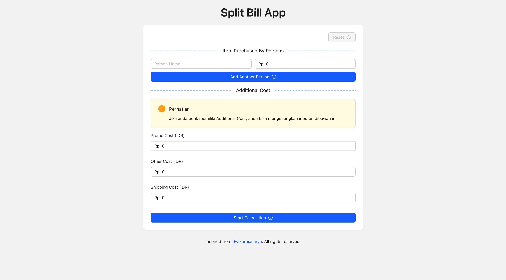

# SPLIT BILL APP

This Project is made with Next JS v14.2.16 and with Ant Design as a CSS Framework.



## Requirement before run this project

- Node Js : v18.18.0 (minimum version)
- Bun : v1.1.121 (bun version installed in my local device)

## How to run this project?

First you have to clone this project for sure, and then after you clone this project you can run this command in cmd :

```bash
  bun install
```

After all depedencies success to install, you can run the project using this command :

```bash
  bun dev
```
